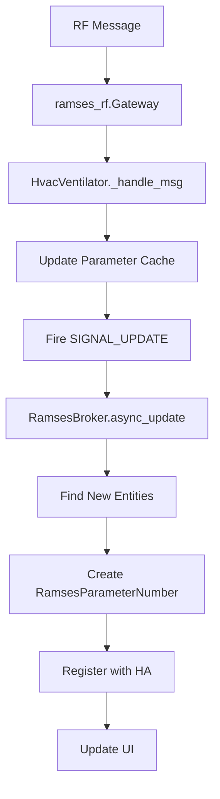

# 2411 Parameter Flow in Ramses CC

This document outlines the complete flow of 2411 parameter messages from RF reception to UI display in the Ramses CC integration.

## Overview

2411 parameters are configuration values for HVAC devices that can be read and written. The flow involves multiple components working together:

1. RF Communication Layer
2. Device State Management
3. Home Assistant Integration
4. UI Layer

## Broker and Gateway Architecture

The Ramses CC integration uses a broker-based architecture to manage communication between Home Assistant and the RF network:

### RamsesBroker
- **Role**: Central coordinator between Home Assistant and the RF network
- **Initialization**:
  - Created in `async_setup_entry` in `__init__.py`
  - Manages the gateway connection and device lifecycle
  - Handles platform setup and entity management
- **Key Responsibilities**:
  - Maintains device registry
  - Coordinates platform initialization
  - Routes updates between devices and entities
  - Manages the update cycle

### Gateway Connection
- **Initialization**:
  - Created via `_create_client()` in the broker
  - Configured with serial port settings from integration config
  - Handles low-level RF communication
- **Message Flow**:
  - Receives raw RF messages from the HGI80 or compatible gateway
  - Parses messages into structured format
  - Routes messages to appropriate devices
  - Maintains connection state and handles reconnections

### Device Management
- **Device Discovery**:
  - Devices are discovered through RF traffic
  - Each device is wrapped in a device-specific class (e.g., `HvacVentilator`)
  - Devices are registered with the broker
- **Parameter Support**:
  - Detected through device capabilities
  - Parameters are exposed as dynamic properties (e.g., `device.param_01`)
  - Support is determined at runtime

### Update Cycle
1. Broker's `async_update` is called periodically (default: 60s)
2. Discovers new devices and parameters
3. Creates/updates entities as needed
4. Triggers state updates through dispatcher signals

## Detailed Flow

### 1. RF Message Reception
- **Hardware**: RF message received by HGI80 or compatible gateway
- **Library**: `ramses_rf` receives the raw message
- **Parsing**: Message is parsed into a structured format

### 2. Device Processing (`ramses_rf`)
- **Message Routing**: `Gateway._handle_msg` routes the message to the appropriate device
- **Device Handling**: `HvacVentilator._handle_msg` processes 2411 messages
  - Updates internal parameter cache
  - Triggers parameter update events
  - Updates device state

### 3. State Update Notification
- **Dispatcher Signal**: Device fires `SIGNAL_UPDATE` via `async_dispatcher_send`
- **Broker Notification**: `RamsesBroker` receives update notification
- **Example Log**:
  ```
  [PARAM_DEBUG] Received update for parameter 01 on device 32:153289, updating state
  [32:153289] Parameter 01 (Fan Speed) = 20.0
  ```

### 4. Broker Update Cycle
- **Periodic Update**: `RamsesBroker.async_update` runs (every 60s by default)
- **Entity Discovery**: `find_new_entities` detects new devices/parameters
- **Platform Notification**: Calls platform-specific handlers via `async_add_entities`
- **Example Log**:
  ```
  [BROKER] Starting update cycle
  [BROKER] Found 3 parameters for device 32:153289
  [BROKER] Creating number entities for parameters: ['01', '02', '03']
  ```

### 5. Number Platform Handling (`number.py`)
- **Entity Creation**: `RamsesParameterNumber` entities are created for parameters
- **Registration**: Entities are registered with Home Assistant
- **Initial State**: Entities fetch initial parameter values
- **Example Log**:
  ```
  [NUMBER] Creating parameter entity for device 32:153289 parameter 01
  [NUMBER] Unique ID generated: 32_153289_param_01
  [NUMBER] Entity registered: number.fan_32_153289_fan_speed
  ```

### 6. UI Update
- **Entity Registration**: Home Assistant adds entities to the registry
- **State Updates**: Entities update via `async_write_ha_state`
- **UI Refresh**: Home Assistant UI reflects the current state

## Key Components

### ramses_rf Layer
- `Gateway`: Manages RF communication
- `HvacVentilator`: Handles 2411 parameter messages
- `Message` classes: Parse and validate RF messages

### ramses_cc Layer
- `RamsesBroker`: Manages devices and platform integration
- `number.py`: Implements parameter number entities
- `RamsesParameterNumber`: Represents a single parameter as a number entity

### Home Assistant Core
- Entity Registry: Tracks all entities
- State Machine: Manages entity states
- UI Layer: Displays entities to users

## Data Flow



## Error Handling
- Invalid messages are logged and discarded
- Parameter validation ensures only valid values are accepted
- Failed updates are retried according to Home Assistant's retry logic
- **Example Error Log**:
  ```
  [WARNING] [32:153289] Invalid value 150 for parameter 01 (Fan Speed), must be between 0-100
  [DEBUG] [32:153289] Retrying parameter update in 5 seconds
  ```
- **Recovery**:
  - Failed parameter reads are automatically retried
  - Invalid values are clamped to valid ranges
  - Connection issues trigger reconnection attempts

## Comparison with Other Entity Types

### Similarities with Sensor Entities

1. **Message Flow**:
   - Both parameters and sensors follow the same initial message flow from RF reception to device processing
   - Both use the broker's update cycle for state management
   - Both integrate with Home Assistant's entity system

2. **Update Mechanism**:
   - Both use dispatcher signals for state updates
   - Both leverage Home Assistant's entity lifecycle
   - Both support dynamic discovery and creation

### Key Differences

#### 1. Entity Creation
- **Parameters**:
  - Dynamically created based on 2411 parameter support
  - Each parameter is a separate `RamsesParameterNumber` entity
  - Support is determined at runtime through device capability detection

- **Sensors**:
  - Created based on fixed device capabilities (temperature, humidity, etc.)
  - Defined by device type and class
  - Capabilities are typically static and known in advance

#### 2. State Management
- **Parameters**:
  - Use dynamic properties (e.g., `device.param_01`)
  - Require type conversion and validation
  - Support both read and write operations
  - Include min/max value enforcement

- **Sensors**:
  - Use direct property access (e.g., `device.temperature`)
  - Typically read-only
  - Simple value mapping without validation
  - Fixed value ranges based on sensor type

#### 3. Configuration
- **Parameters**:
  - Configuration is dynamic and can change at runtime
  - Includes metadata like min/max values, step size, and units
  - May require special handling for different data types

- **Sensors**:
  - Configuration is static and defined by device class
  - Standardized across devices of the same type
  - Simple value reporting without configuration options

#### 4. UI Integration
- **Parameters**:
  - Appear as number entities with configurable sliders
  - Include metadata in the UI (min, max, step, unit)
  - Support user modification through the UI

- **Sensors**:
  - Display as read-only values
  - May include device class-specific rendering (e.g., temperature with °C)
  - No user modification through the UI

## Performance Considerations
- Parameter updates are batched where possible
- UI updates are rate-limited
- State changes are debounced to prevent excessive updates
